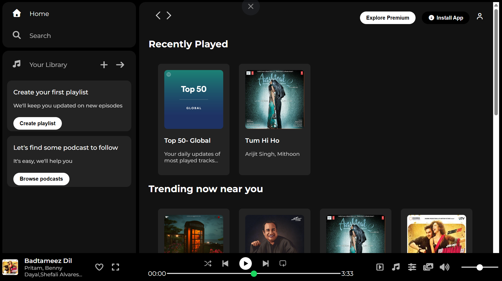
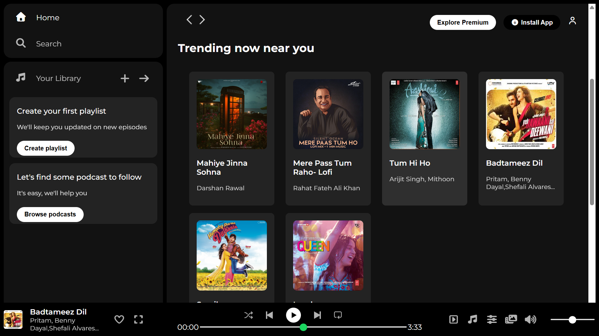
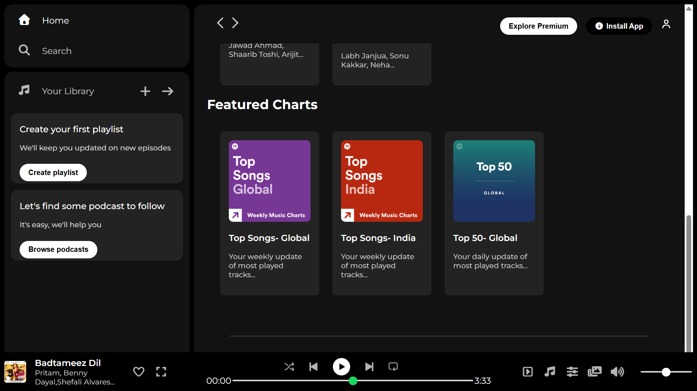

# 🎵 Spotify UI Clone

A responsive Spotify-inspired web player interface built using **HTML5** and **CSS3**. This project recreates the look and feel of Spotify's web application, including the sidebar navigation, music cards, player controls, and modern dark theme.

## 🚀 Live Demo


## 📸 Preview

### Home Page


### Trending Section


### Featured Charts


### Browser View


## ✨ Features

* Responsive Spotify-inspired user interface
* Sidebar navigation menu
* Music library section
* Recently Played, Trending, and Featured Charts sections
* Sticky navigation bar
* Music player layout with controls
* Mobile-friendly design using media queries
* Clean and modern dark theme

## 🛠️ Technologies Used

* HTML5
* CSS3
* Flexbox
* Font Awesome Icons
* Google Fonts (Montserrat)

## 📂 Project Structure

```text
spotify-ui-clone/
│
├── index.html
├── style.css
├── assets/
│   ├── backward_icon.png
│   ├── card1img.jpeg
|   ├── card2img.jpeg
|   ├── card3img.jpeg
|   ├── card4img.jpg
|   ├── card5img.jpeg
|   ├── card6img.jpeg
|   ├── card7img.jpg
|   ├── card8img.jpg
|   ├── card9img.jpg
│   ├── forward_icon.png
│   ├── library_icon.png
│   ├── logo.png
│   ├── play_musicbar.png
│   ├── player_icon1.png
│   ├── player_icon2.png
│   ├── player_icon3.png
│   ├── player_icon4.png
│   └── player_icon5.png
├── Screenshots/
│   ├── spotify-browser-view.png
│   ├── home-page.png
│   ├── trending-section.png
│   └── featured-charts.png
│
└── README.md
```

## 📱 Responsiveness

The project includes responsive design using CSS media queries and adapts to:

* Desktop Screens
* Laptops
* Tablets
* Mobile Devices

## 🎯 Learning Outcomes

This project helped me practice:

* HTML page structuring
* CSS styling and layouts
* Flexbox
* Responsive Web Design
* UI Recreation from a Real-World Application
* Working with Icons and External Fonts

## 🔮 Future Improvements

* Add JavaScript functionality
* Implement music controls
* Add interactive playlists
* Create search functionality
* Improve mobile responsiveness
* Connect to a music API

## ⚠️ Disclaimer

This project is created for educational and learning purposes only. Spotify is a trademark of Spotify AB. This project is not affiliated with or endorsed by Spotify.

## 👨‍💻 Author

**Vriddhi Mishra**

GitHub: https://github.com/VriddhiMishra

---

⭐ If you liked this project, consider giving it a star!
